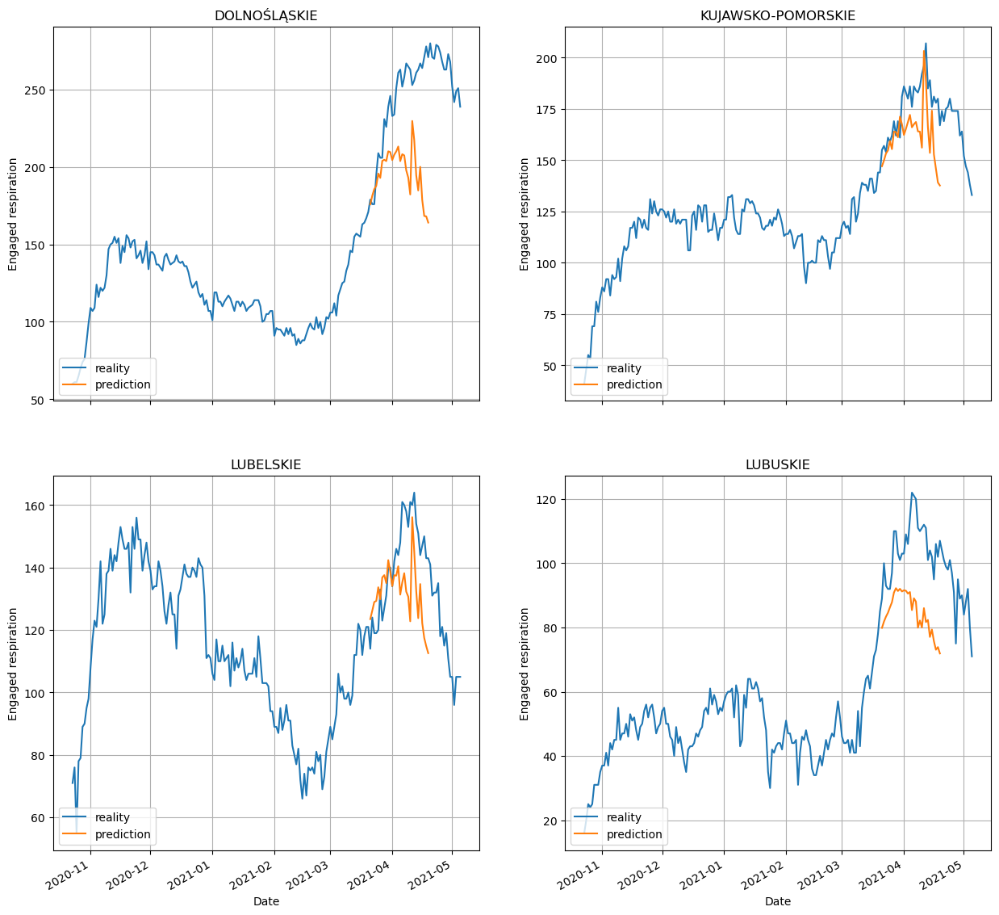
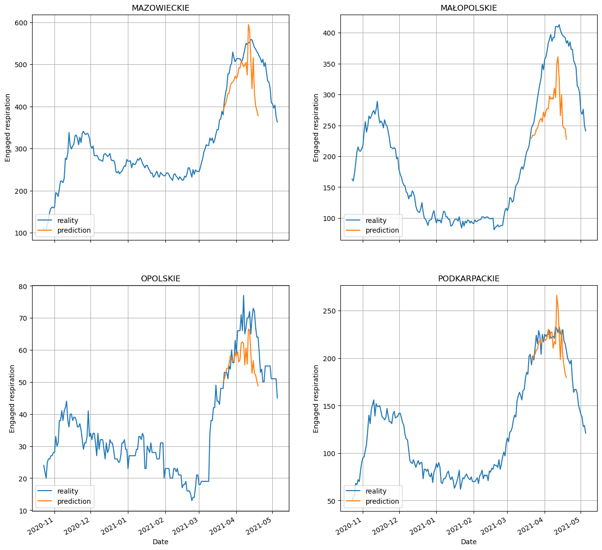
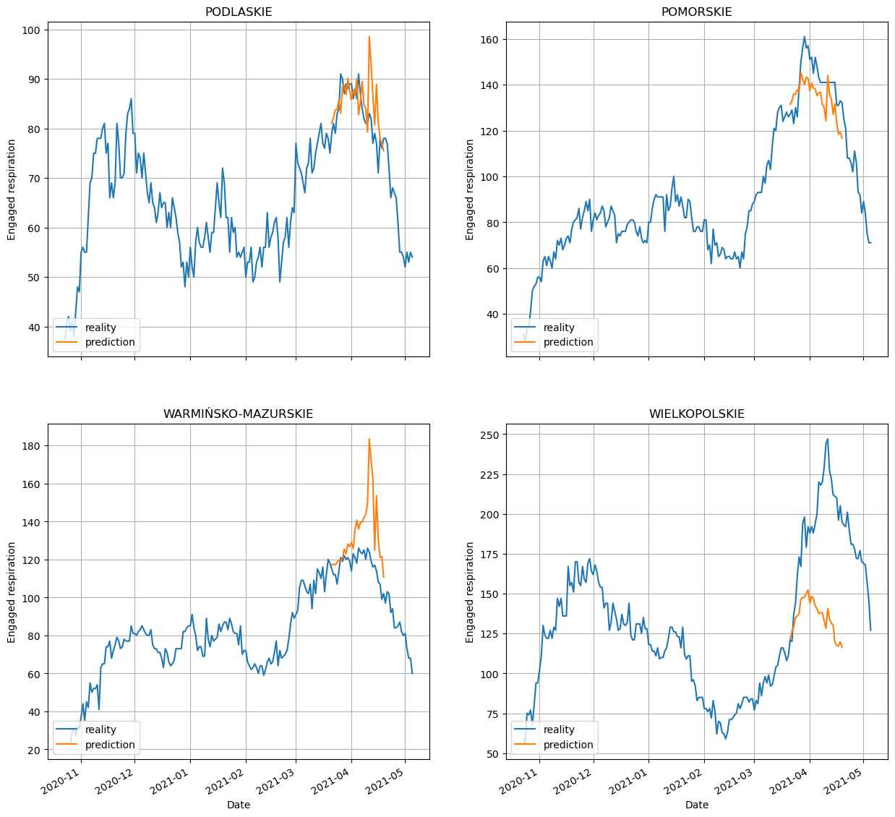
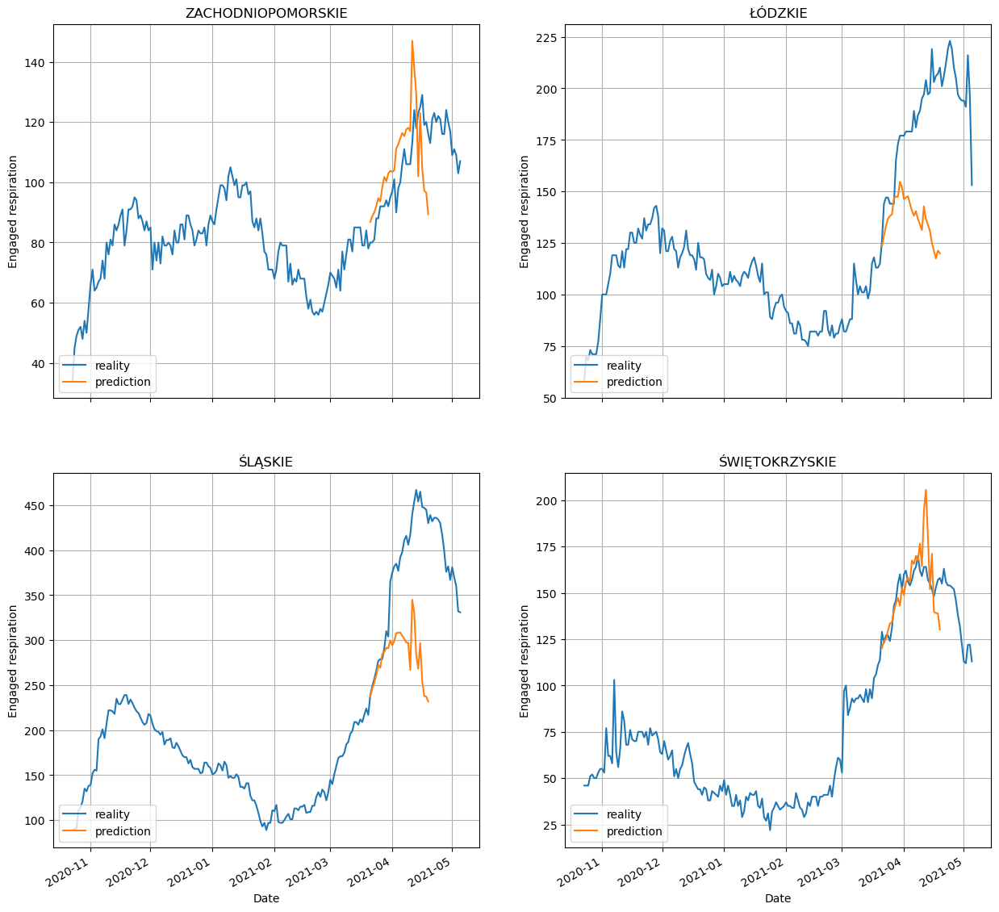
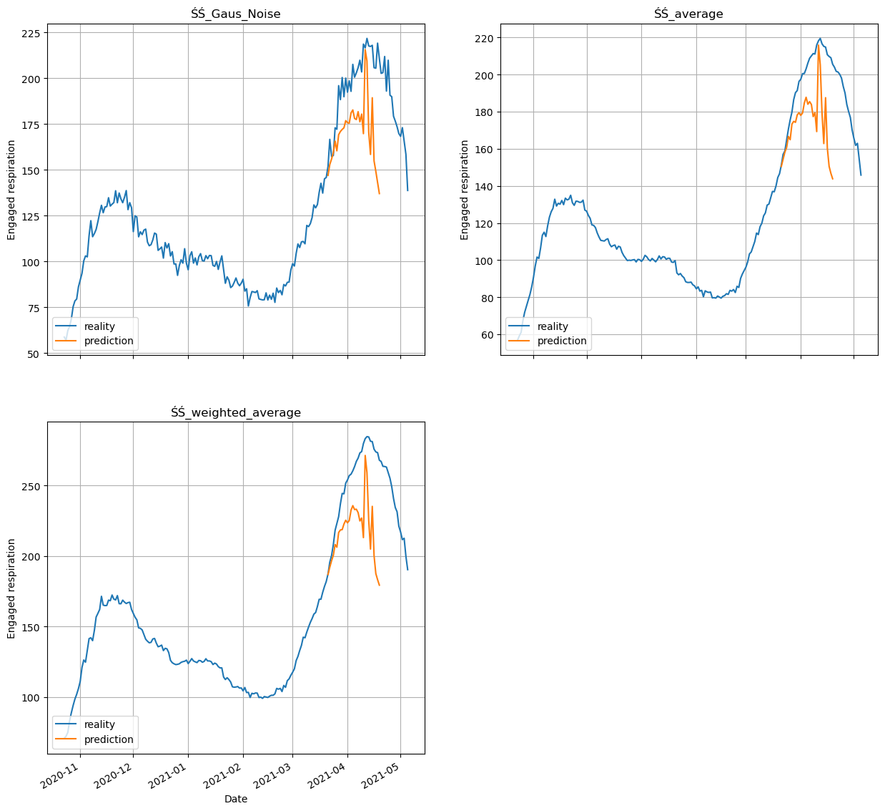
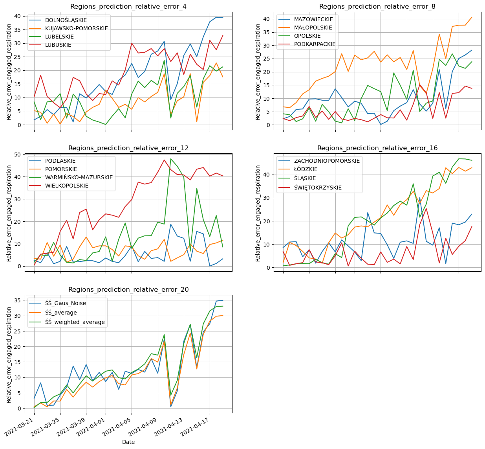
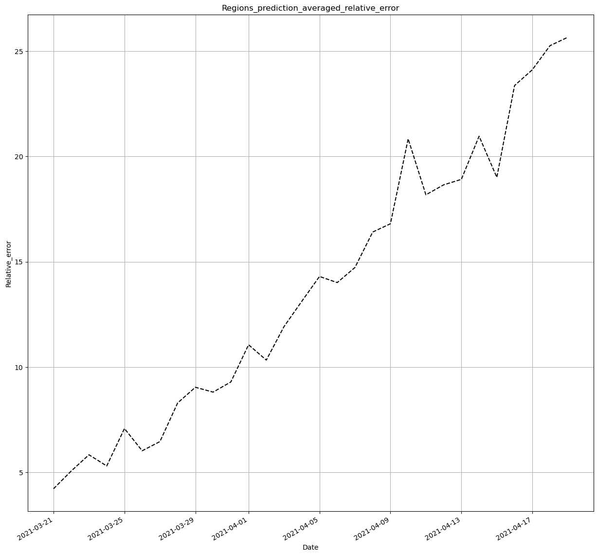
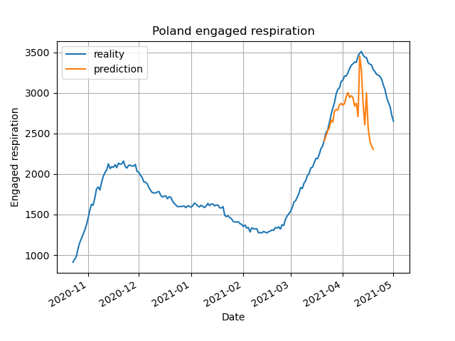
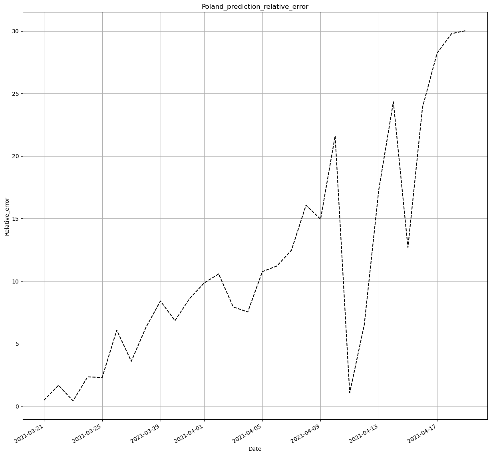
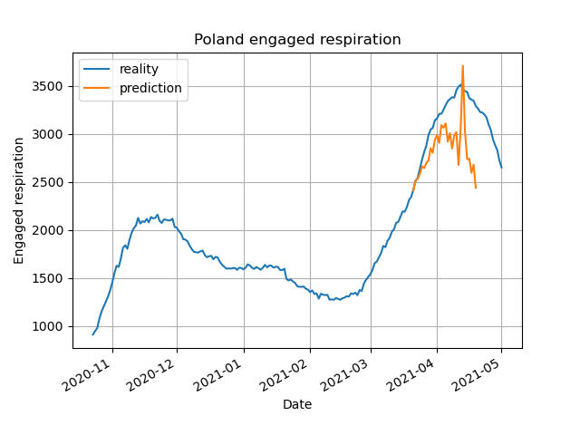

About
=========
This is my first big machine learning project that I did on 03.2021 - 09.2021.

Purpose of the project
=============

Predicting the occupied covid repairers for voivodeships and Poland.

Run
=============
Run RNN/main.py

``` {.python}
result = make_prediction_and_subplot_for_all_regions(last_day_train= '2021-03-25', day_ahead=21, period_of_time_learning=7)
```

If it sets last_day_train = None, the prediction should be up-to-date. Unfortunately, the data source from which the
current pandemic data is retrieved has ceased to be updated since 08.2021.

Data used
================

1. Data on the percentage change in mobility for the voivodeship from Google.

2. Epidemiological situation in voivodships.

3. Data on the population of Poland.

Merged data has the following 12 attributes:

1. Region-Voivodship or Poland

2. Date - from 20/10/2020

3. Day of the week - (from 1 to 7, converted to 7 binary columns)

4. Population per square km

5. Percentage of the area to the area of Poland

6. Percentage change in staying in retail places i recreational in relation to the baseline

7. Percentage change in staying in food industry places and pharmacy in relation to the reference state

8. Percentage change in being in public transport stations in relation to the baseline

9. Percentage change in visiting workplaces relative to the state reference

10. Percentage change in living in flats compared to the state reference

11. Number of hospitalized persons

12. Number of occupied ventilators (severe condition)

Google's baseline is the median of the 5-week value the period from January 3 to February 6, 2020 (the day of the week
is taken into account). \
Due to the large lack of data, I did not use the percentage data change of staying in the Parks. Other gaps in mobility
data I supplemented with interpolation. \
I did not standardize the data. I expressed the percentage data from 0 to 1.

Data Augmentation
-----------

To increase my training set, I created three regions:

1. Average of all voivodships

2. Weighted average, based on the proportion to the number of the voivodship's population to the population of Poland.

3. Gauss noise superimposed on the average of all voivodeships.

Model
=====

Input
-----

For the attribute describing the region, I used the oneHotEncode algorithm. Next I was creating a training set with each
row containing a two weeks day history, including all quantitative columns.

Output
------

The target variable is the number of occupied ventilators.

Neuron network
--------------

I use a simple dense deep neural network (RNN/model/simple_regression).

Also tried to use the LSTM neural network, however did not get satisfactory results.

Test set
-------------

The test set is the last day of the prediction with a two-week history for each region.

Model operation
----------------

For each prediction of the nth day ahead, the model works **independently**, that is, it first does a training set, and
then follows the learning. When finished, there is **prediction** number of ventilators occupied for on day n forward
from test data. Finally, the model is reset.

Results
======

Monthly anticipation as the last training day on 03/20/2021.

For provinces
--------------











Relative error charts
------------------------





For Poland
----------

The results for Poland were the average for the region, which I multiplied by number of provinces.



Wykres błędu względnego dla Polski
----------------------------------




Conclusions from the graphs
------------------

- The two-week forward prediction is good because the error is average the relative is less than 15%.

- The accuracy of the prediction is very dependent on the province, but the error is average relative has linear
  complexity.

- The large oscillation of the graphs is due to the fact that each prediction w front is independent, therefore taking
  an average of three or seven days hadn't smoothed out these charts.

- The day of the week matters a lot, which also contributes to a big fluctuations.

- Increasing the amount of data, through augmentation, has improved prediction, therefore probably adding more
  artificially voivodeships generated by Gaussian noise would cause smoothing and improving predictions.

- To make predictions for Poland, it is better to take the mean from all provinces and multiply the result by 16 than to
  take the sum
  (occupied beds and respirators).

- The forecast for Poland is on average more accurate than for provinces, and even the model well predicted the peak of
  the pandemic.

- The shape of the chart for Poland is very similar once again the launch of the model, however, differs significantly
  after two weeks, is caused by a small amount of data (which reduces dependencies on prediction), therefore predicting
  more than two weeks ahead it is unstable.




Źródła
======

- Mobility data - https://www.google.com/covid19/mobility/

- Data on the pandemic situation- -https://docs.google.com/spreadsheets
  /u/1/d/1ierEhD6gcq51HAm433knjnVwey4ZE5DCnu1bW7PRG3E/ htmlview?fbclid=IwAR0oqN4ikk1flMvFbb0ecLOKGpkHo7LCYj75N6Z1vc4n
  \_kuhtI214dqN5Ho

- GUS data on the area and population of voivodeships-
  https://stat.gov.pl/obszary-tematyczne/ludnosc/ludnosc
  /powierzchnia-i-ludnosc-w-przekroju-terytorialnym-w-2020-roku,7,17.html

- Model inspiration -
  https://towardsdatascience.com/deep-neural-networks-for-regression-problems-81321897ca33


